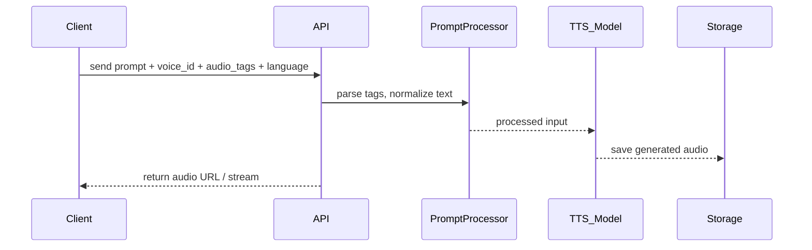
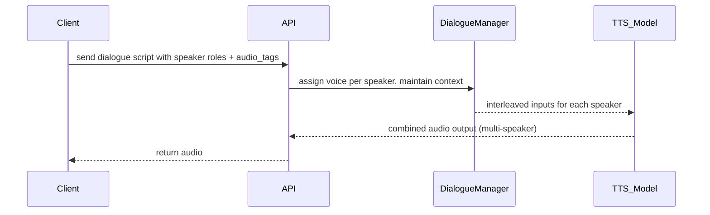
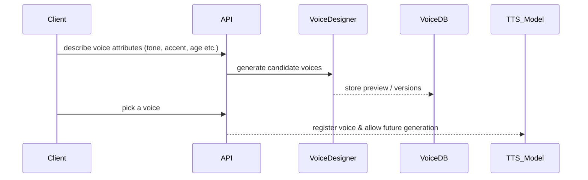
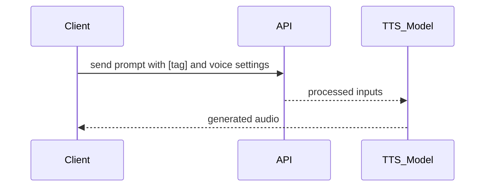
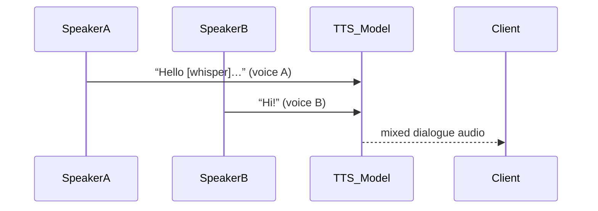

# ElevenLabs v3 — Architecture Documentation (Markdown)

> Purpose: describe architecture of ElevenLabs v3 (TTS + Dialogue + “Audio Tags” model), internals, workflows & components.  
> Audience: engineers designing or integrating with ElevenLabs v3, prompt engineers, product teams.

---

## Table of contents
1. [Executive summary](#executive-summary)  
2. [High-level components](#high-level-components)  
3. [Key features & new capabilities](#key-features--new-capabilities)  
4. [Control / API flow vs Model / Inference flow](#control--api-flow-vs-model--inference-flow)  
5. [Key workflows (with mermaid diagrams)](#key-workflows-with-mermaid-diagrams)  
   - Prompt → Speech (Audio Tags usage)  
   - Multi‑Speaker Dialogue mode  
   - Voice Design / Voice Creation v3  
6. [Deep dive: Model internals & inference process](#deep-dive-model-internals--inference-process)  
7. [Scaling, availability & deployment patterns](#scaling-availability--deployment-patterns)  
8. [Operational considerations & best practices](#operational-considerations--best-practices)  
9. [Appendix — mermaid templates](#appendix---mermaid-templates)  
10. [References](#references)

---

## Executive summary
ElevenLabs v3 (alpha) is their most advanced text‑to‑speech model, designed for expressive, natural, emotionally rich speech. It introduces **Audio Tags** (inline cues like `[whispers]`, `[laughs]`, etc.), **multi‑speaker dialogue mode**, and supports 70+ languages. It enables creators to produce speech that feels like performance, rather than flat recitation. ([elevenlabs.io](https://elevenlabs.io/docs/models?utm_source=chatgpt.com))

---

## High-level components
- **Frontend / UI**:  
  User interfaces in ElevenLabs Studio, Voice Designer, or Web tools where prompts are entered, voice settings chosen, audio tags included, preview generated.

- **API / Backend**:  
  REST endpoints for Text‑to‑Speech, Text‑to‑Dialogue, Voice Creation / Voice Design, voice assets, models, usage & quotas. Handles authentication, prompt validation, processing, etc.

- **Model / Inference engine**:  
  The core neural TTS model(s) v3, which parse text + audio tags + speaker voice (if voice clone or design), generate mel spectrogram / waveform output.

- **Prompts processing layer**:  
  Handling of audio tags, parsing emotional / delivery instructions, normalization of text, accent/language detection or switching. Dialogue context handling if multiple speakers.

- **Voice assets / voice library**:  
  Pre‑designed voices, cloned voices, voice design generated voices.  

- **Storage & infrastructure**:  
  For audio files (generated speech), model weights, caching / pre‑rendering, GPU inference.  

- **Monitoring / Quality / Feedback loop**:  
  Metrics such as naturalness, latency, user feedback, error rates.

---

## Key features & new capabilities
- **Audio Tags**: inline bracketed tags to control emotion, tone, non‑verbal cues, pacing.  
- **Multi‑speaker Dialogue Mode**: ability to generate conversations (multiple voices) in a coherent context.  
- **Voice Design v3**: prompt‑based voice creation (describe voice, generate samples).  
- **Language support**: 70+ languages.  
- **Expressiveness and performance**: contextual understanding, emotional richness, more control over delivery.  

---

## Control / API flow vs Model / Inference flow

- **Control / API flow**:  
  User sends request → prompt + parameters (voice, tags, dialogue mode, language) → API validates input → inference engine → audio output → return audio.  

- **Model / Inference flow**:  
  Parsed text + audio tags → tokenization → feature extraction → context integration → generation (spectrogram or waveform) → vocoding → audio file.

---

## Key workflows (with mermaid diagrams)

### 1) Prompt → Speech (Audio Tags usage)

---

### 2) Multi‑Speaker Dialogue Mode

---

### 3) Voice Design / Voice Creation v3

---

## Deep dive: Model internals & inference process

- **Text & Tag parsing**: Recognizing inline audio tags; mapping them to internal control signals.  
- **Prompt encoding**: Tokenization of text + voice metadata + context.  
- **Contextual modeling**: Context across speakers / emotional transitions.  
- **Core TTS generation**: Transformer / diffusion / neural architectures.  
- **Vocoder**: Converts intermediate representation to audio waveform.  
- **Audio pipeline**: post‑processing, formatting (mp3, wav etc).  

---

## Scaling, availability & deployment patterns

- **Inference servers**: GPU clusters.  
- **Caching**: For common voices / prompts.  
- **Regional endpoints**: Lower latency globally.  
- **Rate limits & concurrency controls**: Manage load.  
- **Model versioning & A/B testing**: Especially for v3 alpha.

---

## Operational considerations & best practices

- **Prompt engineering**: Tags placement, ordering, speaker roles matter.  
- **Latency vs quality**: More tags/dialogue = longer processing.  
- **Voice consistency**: Same settings across dialogue.  
- **Language coverage**: Edge cases for rare languages.  
- **Cost & compute**: Expressivity increases GPU time.  
- **Monitoring**: Feedback, errors, quality.  
- **Safety & misuse**: Voice cloning, ethical concerns.

---

## Appendix — mermaid templates

### Audio‑Tag Prompt Template

### Dialogue Template

---

## References
- [ElevenLabs Models](https://elevenlabs.io/docs/models?utm_source=chatgpt.com)  
- [Audio Tags blog](https://elevenlabs.io/blog/v3-audiotags?utm_source=chatgpt.com)  
- [Voice Design v3 blog](https://elevenlabs.io/blog/voice-design-v3?utm_source=chatgpt.com)  
- [v3 product page](https://elevenlabs.io/v3?utm_source=chatgpt.com)  
