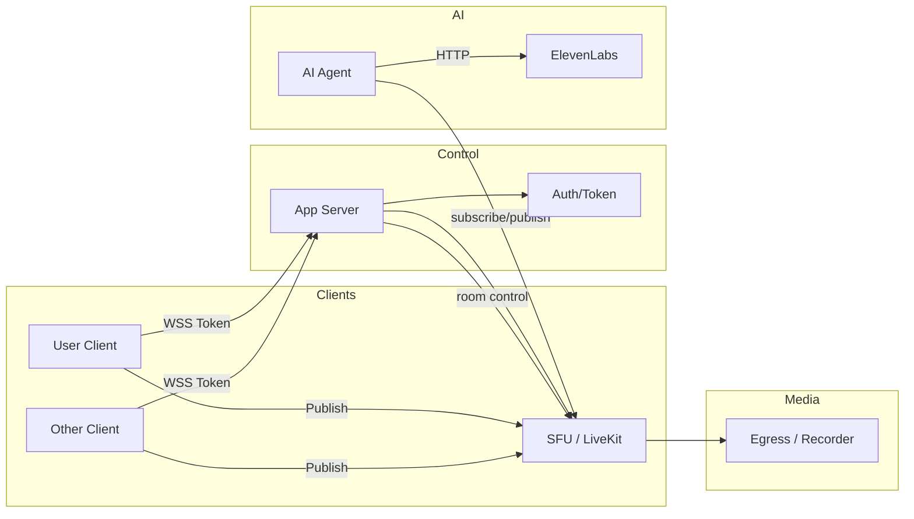

# Real-Time Communication (RTC) Architecture

This document describes a concise RTC architecture focused on WebRTC signaling, media path (SFU/MCU), and integration points for AI agents and external speech services.

## Key components

- **Clients (Web/Mobile)**: Use the LiveKit SDK or native WebRTC APIs to capture and play audio/video tracks.
- **Signaling / App Server**: Issues tokens, coordinates room lifecycle, and performs control-plane tasks (invite, kick, role management).
- **SFU (Selective Forwarding Unit)**: Receives published tracks from peers and forwards them to subscribers (low CPU, scalable).
- **AI Agent / Media Worker**: Optional backend participant that subscribes to user streams, performs transcription or synthesis, and can publish audio back into the room.
- **External Services**: Speech-to-text, text-to-speech (ElevenLabs), recording/egress services.

## Architecture diagram

## Typical flows

1. Client requests token from `App Server` and connects to SFU with WSS.
2. Client publishes audio/video tracks to SFU.
3. SFU routes tracks to subscribers (other clients, AI Agent).
4. AI Agent subscribes to user audio, processes it (STT/NLP), and optionally publishes TTS audio back to SFU.
5. Egress/recorder captures room streams for storage or analytics.

## Notes

- Prefer SFU for group calls to reduce server CPU and latency.
- Use short-lived tokens and role-based permissions for secure room access.
- For deterministic diagrams, add a CI step to render Mermaid to SVG.
