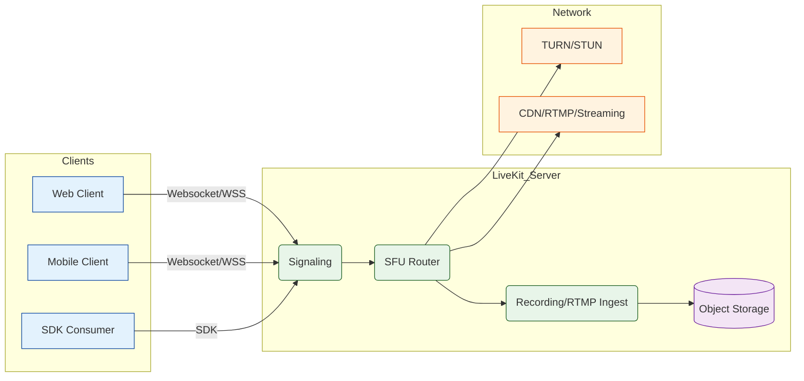

# LiveKit Architecture (Mermaid)

This document contains a Mermaid diagram that visualizes the core LiveKit architecture: clients, signaling, SFU routing, TURN/STUN, recording/ingestion, and optional external services.

Notes:
- Paste this Markdown file into your repository and GitHub will render the Mermaid diagram on the file page (GitHub supports Mermaid in Markdown).
- You can edit nodes and edges in the `flowchart` block to match your exact LiveKit deployment (participants, rooms, media servers, scale-out patterns).
