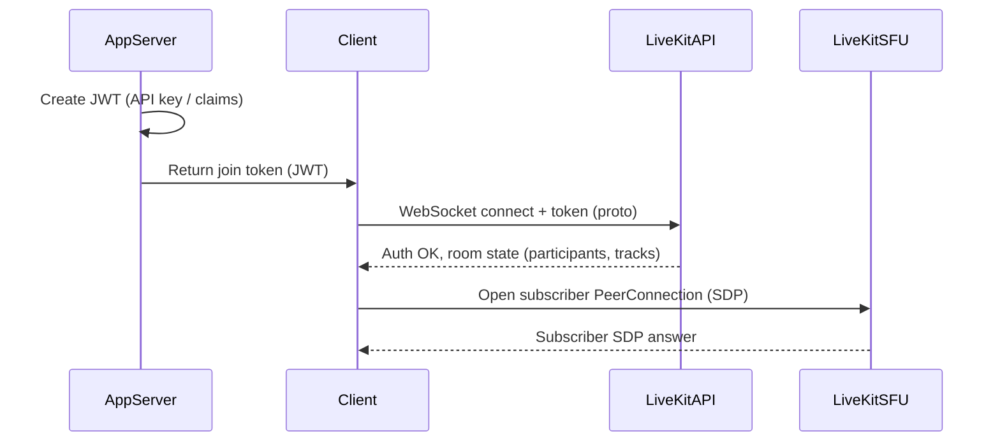
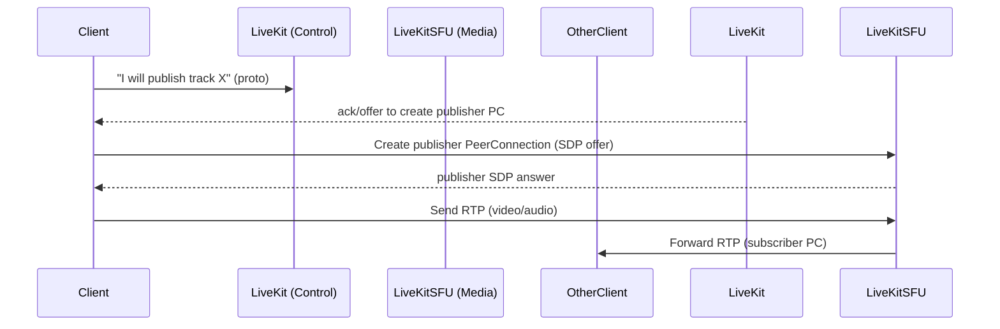
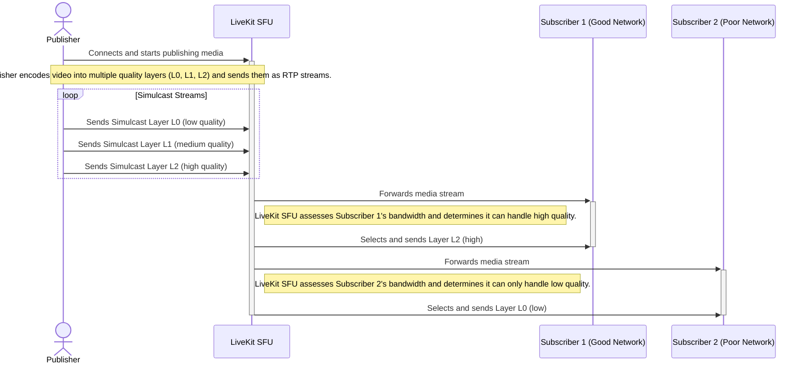
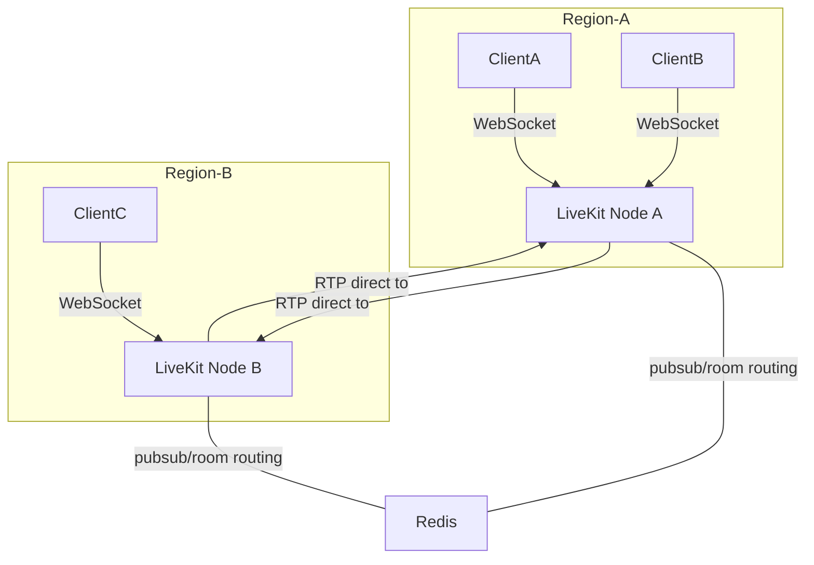
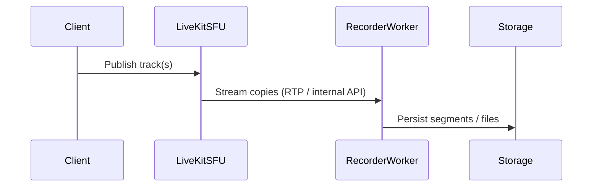
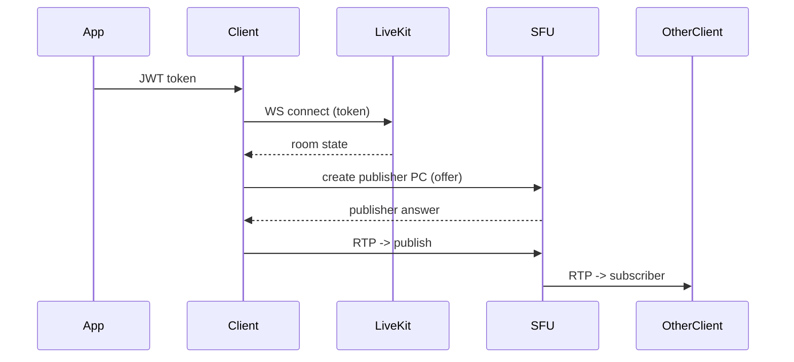

# LiveKit — Architecture Documentation (Markdown)

> Purpose: comprehensive architecture doc + deep dive on LiveKit internals, explicit workflow diagrams, and executable diagrams in **mermaid.js**.  
> Audience: engineers who need to design, operate, or extend LiveKit (self-hosted or Cloud).

---

## Table of contents
1. [Executive summary](#executive-summary)  
2. [High-level components](#high-level-components)  
3. [Control plane vs Media plane](#control-plane-vs-media-plane)  
4. [Key workflows (with mermaid diagrams)](#key-workflows-with-mermaid-diagrams)  
   - Client Join / Token flow  
   - Publish / Subscribe sequence (two PeerConnections)  
   - Simulcast / Layer selection & SFU forwarding  
   - Multi-node routing & Redis mesh  
   - Recording / Ingest / Server API usage  
5. [Deep dive: SFU internals & media pipeline](#deep-dive-sfu-internals--media-pipeline)  
6. [Scaling, HA, and deployment patterns](#scaling-ha-and-deployment-patterns)  
7. [Operational considerations & troubleshooting tips](#operational-considerations--troubleshooting-tips)  
8. [Appendix — mermaid templates you can paste anywhere](#appendix---mermaid-templates-you-can-paste-anywhere)  
9. [References](#references)

---

## Executive summary
LiveKit is an open-source WebRTC stack built to act as a scalable SFU (Selective Forwarding Unit). It provides client SDKs, a server (written in Go using Pion), server APIs for room/participant management, and an architecture that supports single-node deployments as well as multi-node, globally-distributed Cloud deployments. LiveKit separates signaling/control (WebSocket + protobuf) from the media forwarding plane (WebRTC RTP PeerConnections) and uses a distributed routing layer (Redis) when used in multi-node mode.

---

## High-level components
- **Client SDKs** (browser, iOS, Android, server SDKs): handle capture, rendering, encoding/decoding, and the LiveKit client protocol. Clients speak a protobuf over WebSocket to the server for signaling and open up WebRTC PeerConnections to the SFU.  
- **LiveKit Server (SFU)**: the media node that receives RTP from publishers and forwards RTP to subscribers (selective forwarding). Implemented in Go using Pion. Can run as one node or as many nodes.  
- **Redis (routing layer)**: used to coordinate multi-node deployments (peer routing / room-to-node mapping). Required for distributed setups.  
- **STUN/TURN**: for NAT traversal and relaying media as needed. (Standard WebRTC components.)  
- **Application Server / Auth**: your application issues JWT tokens (or uses LiveKit auth patterns) and calls LiveKit Server APIs (manage rooms, participants, SIP trunking, recording).  
- **Optional components**: recording workers, ingestion (RTMP), media processors (transcription/AI pipelines), SIP gateways.

---

## Control plane vs Media plane
- **Control plane**: WebSocket + protobuf messages between client and server (join, publish intent, subscription updates, metadata, data channel control). This is reliable, ordered, and used to coordinate state.  
- **Media plane**: UDP (RTP/RTCP) over WebRTC PeerConnections. Typically two PeerConnections per client: one for subscribing (always open), one for publishing (opened when the client actually publishes). SFU receives RTP, performs any transformations (e.g., SSRC mapping, simulcast selection, RTX/FEC), and forwards RTP to subscribers.

---

## Key workflows (with mermaid diagrams)

### 1) Client Join / Token issuance (high level)


---

### 2) Publish / Subscribe sequence (two PeerConnections)


---

### 3) Simulcast + layer selection (Video quality adaptation)


---

### 4) Multi-node routing and Redis mesh


---

### 5) Recording & Ingest pipeline (typical)


---

## Deep dive: SFU internals & media pipeline
- Written in **Go** using **Pion**.  
- Publisher sends RTP → SFU maps SSRCs → optionally selects simulcast layers → forwards RTP to subscribers.  
- Bandwidth estimation done per-subscriber, informs simulcast selection.  
- Two PeerConnections: subscriber (always), publisher (on demand).

---

## Scaling, HA, and deployment patterns
- **Single-node**: simple but limited.  
- **Multi-node with Redis**: recommended for scale. Redis manages pub/sub, presence, and routing.  
- **Global clusters**: mesh design, regional nodes, 99.99% uptime possible.  
- **Kubernetes**: containers, autoscaling, Redis as stable store.

---

## Operational considerations
- Monitor CPU, bandwidth, PeerConnections, packet loss.  
- Use TURN for NAT traversal reliability.  
- Debug with RTCP and LiveKit verbose logs.

---

## Appendix — mermaid templates

### System architecture
```mermaid
    sequenceDiagram
    participant Client as Client (Browser/Mobile SDK)
    participant AppServer as Your App Server
    participant LiveKitServer as LiveKit Server Node

    Client->>+AppServer: 1. Request to join a room
    Note right of Client: User wants to connect to a specific<br/>LiveKit room (e.g., 'my-room').
    AppServer->>-Client: 2. Return Access Token (JWT)
    Note left of AppServer: Server verifies user identity and generates<br/>a signed JWT token with permissions.

    Client->>+LiveKitServer: 3. Connect (WebSocket) with Token
    Note over Client,LiveKitServer: The LiveKit SDK initiates a secure WebSocket<br/>connection to the LiveKit Server.

    LiveKitServer->>LiveKitServer: 4. Validate Token
    Note right of LiveKitServer: Verifies the JWT signature and permissions.

    alt Connection Successful
        LiveKitServer-->>-Client: 5. Connection Acknowledged
        Note right of Client: WebSocket connection is established.<br/>WebRTC negotiation begins.
    else Connection Failed
        LiveKitServer-->>-Client: 5. Connection Rejected (e.g., invalid token)
    end
```

### Join → Publish → Subscribe
