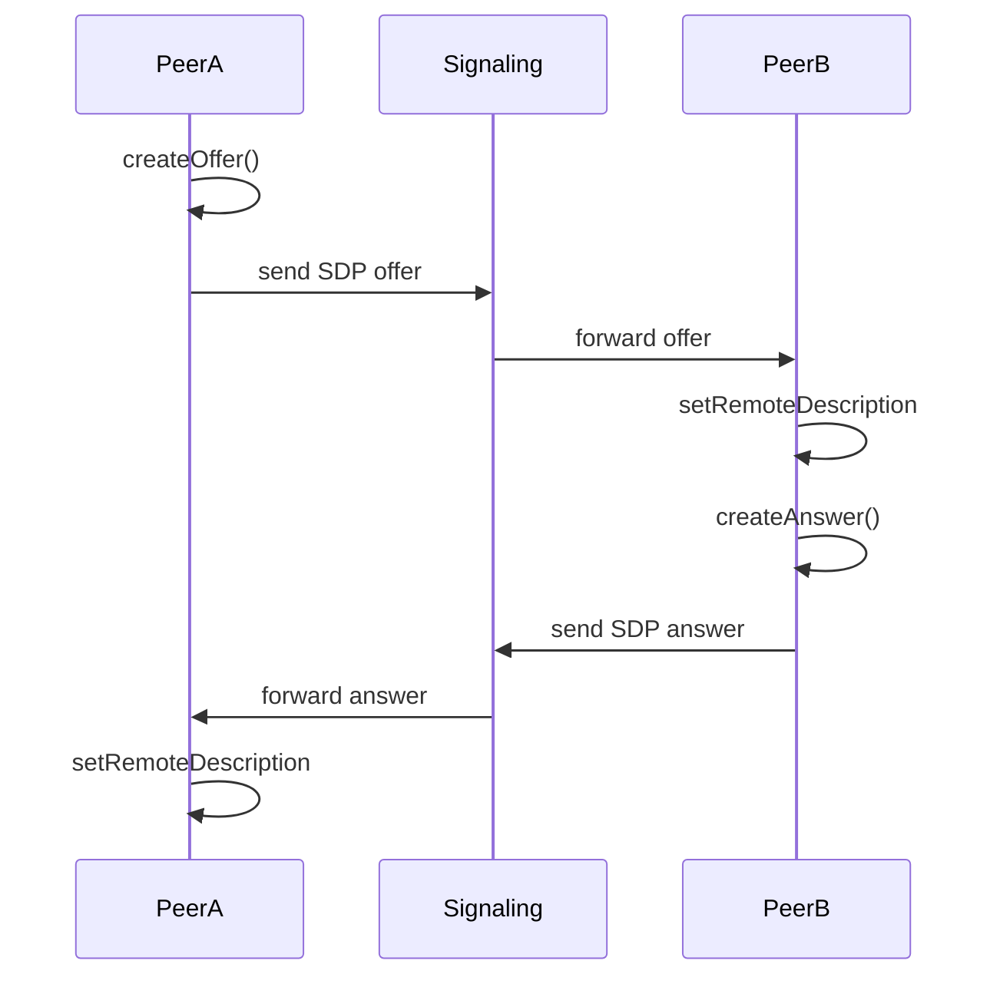
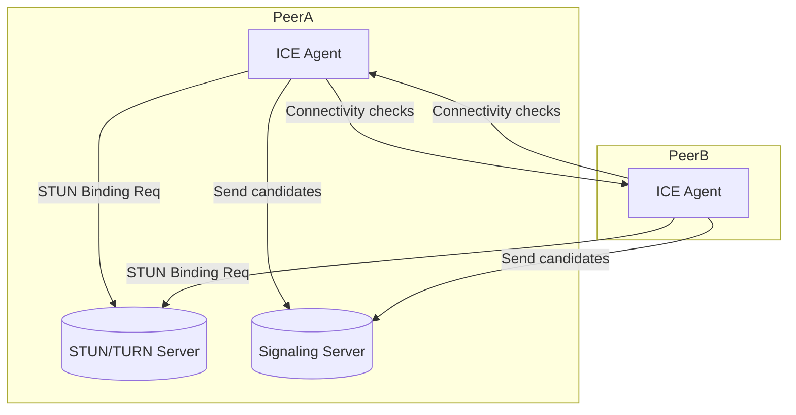
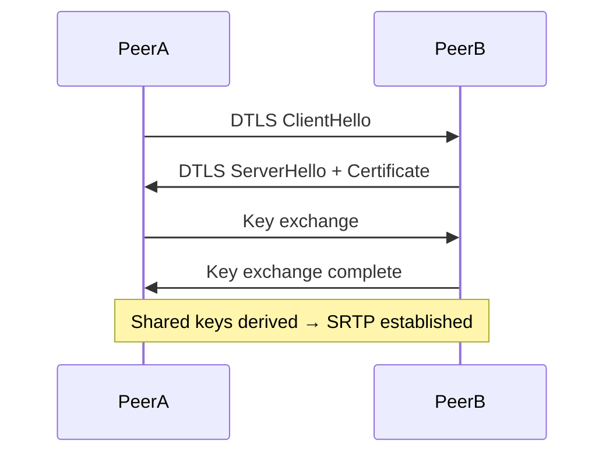
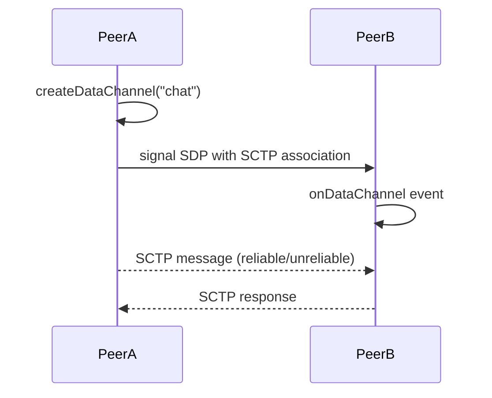
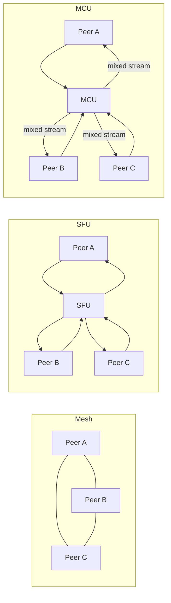
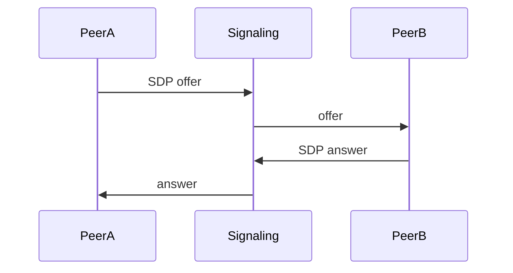
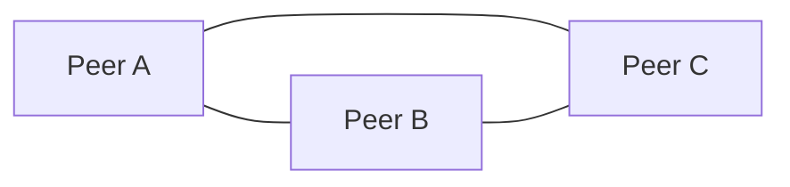

# WebRTC — Architecture Documentation (Markdown)

> Purpose: comprehensive architecture doc + deep dive on WebRTC internals, explicit workflow diagrams, and executable diagrams in **mermaid.js**.  
> Audience: engineers who need to design, operate, or extend WebRTC-based applications.

---

## Table of contents
1. [Executive summary](#executive-summary)  
2. [High-level components](#high-level-components)  
3. [Control plane vs Media plane](#control-plane-vs-media-plane)  
4. [Key workflows (with mermaid diagrams)](#key-workflows-with-mermaid-diagrams)  
   - Offer/Answer (SDP) flow  
   - ICE candidate discovery & connectivity checks  
   - DTLS-SRTP handshake for secure media  
   - DataChannel negotiation  
   - Multi-party mesh vs SFU vs MCU  
5. [Deep dive: Media pipeline internals](#deep-dive-media-pipeline-internals)  
6. [Scaling patterns](#scaling-patterns)  
7. [Operational considerations & troubleshooting tips](#operational-considerations--troubleshooting-tips)  
8. [Appendix — mermaid templates you can paste anywhere](#appendix---mermaid-templates-you-can-paste-anywhere)  
9. [References](#references)

---

## Executive summary
WebRTC (Web Real-Time Communication) is an open standard enabling browsers and apps to capture, encode, and exchange audio, video, and data in real time. It abstracts NAT traversal, encryption, and codec negotiation while allowing developers to build peer-to-peer applications (e.g., video calls, live streaming, multiplayer games).  

WebRTC’s architecture is **peer-centric**, but in practice most deployments add servers (TURN, SFU, MCU, signaling servers) to improve connectivity, scalability, and features.

---

## High-level components
- **Peers** (browser, mobile, native): implement WebRTC stack (getUserMedia, RTCPeerConnection, RTCDataChannel).  
- **Signaling server**: external mechanism (e.g., WebSocket, SIP, MQTT) to exchange SDP and ICE candidates. Not standardized, app-defined.  
- **STUN/TURN servers**: assist with NAT traversal. STUN discovers public addresses; TURN relays when direct peer-to-peer fails.  
- **Media servers (optional)**:  
  - **SFU (Selective Forwarding Unit)**: routes RTP packets to peers.  
  - **MCU (Multipoint Conferencing Unit)**: mixes streams into one composite.  
- **Security layer**: DTLS for key exchange, SRTP for encrypted audio/video, SCTP for DataChannels.

---

## Control plane vs Media plane
- **Control plane**: Application signaling (offer/answer exchange, ICE candidates). Out-of-band, flexible transport.  
- **Media plane**: WebRTC-native stack (RTP/RTCP over UDP/TCP, DTLS-SRTP). Handles audio/video encryption, retransmissions, jitter buffers.

---

## Key workflows (with mermaid diagrams)

### 1) Offer/Answer (SDP) exchange

---

### 2) ICE candidate discovery & connectivity checks

---

### 3) DTLS-SRTP Handshake

---

### 4) DataChannel negotiation

---

### 5) Multi-party topologies

---

## Deep dive: Media pipeline internals
- **Capture**: Microphone/camera capture → raw media frames.  
- **Encode**: Audio (Opus), Video (VP8/VP9/H.264/AV1).  
- **Packetize**: Encoded frames split into RTP packets.  
- **Encrypt**: DTLS key negotiation → SRTP encrypts RTP.  
- **Transport**: RTP/RTCP packets sent via UDP (preferred) or TCP.  
- **Receive path**: Reverse process (decrypt → depacketize → decode → render).  
- **Jitter buffer**: Smooths network irregularities.  
- **Congestion control**: Google Congestion Control (GCC), TWCC feedback.

---

## Scaling patterns
- **P2P mesh**: works for 2–3 peers; scales poorly (N² streams).  
- **SFU**: forwards packets to many; efficient bandwidth, higher server cost.  
- **MCU**: mixes centrally; easier for clients, higher CPU cost server-side.  
- **Hybrid**: mesh for small calls, SFU for larger rooms.

---

## Operational considerations
- **TURN**: deploy to guarantee connectivity behind symmetric NAT/firewalls.  
- **Codecs**: ensure common codec set across browsers.  
- **Security**: DTLS cert rotation, SRTP mandatory.  
- **Debugging**: `chrome://webrtc-internals/`, getStats API, Wireshark RTP analysis.  
- **Monitoring**: log ICE failures, packet loss, bitrate adaptation.

---

## Appendix — mermaid templates

### Offer/Answer quick template

### Multi-party topology template

---

## References
- [WebRTC Official Spec (W3C/IETF)](https://www.w3.org/TR/webrtc/)  
- [MDN — WebRTC API](https://developer.mozilla.org/en-US/docs/Web/API/WebRTC_API)  
- [webrtc.org](https://webrtc.org/)  
- [RFC 8825–8832 series (WebRTC core protocols)](https://www.rfc-editor.org/rfc/rfc8825)  
